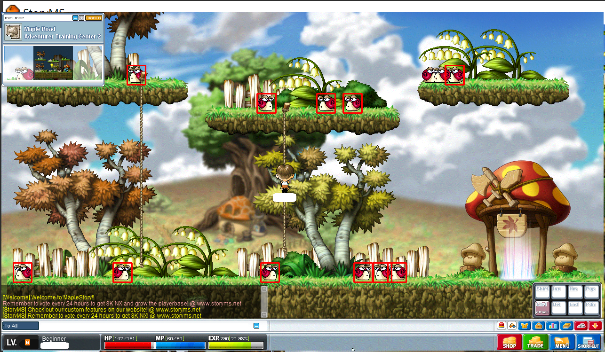

# Orange mushroom game
### `not for playing game, learning AI!`

## Used technology  
- Deep Learning to detect object such as monsters, buff skills, droped items etc.
- windows api to get game screen in realtime.
- open-cv to handle the screen (also pillow, numpy)

