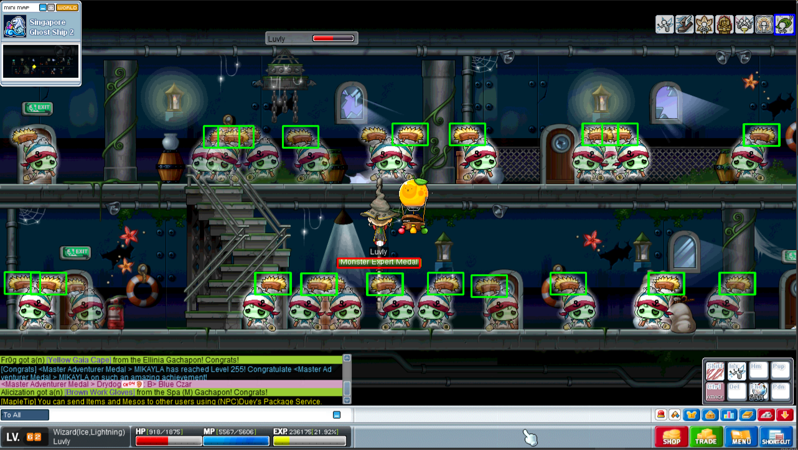

# Orange mushroom game
### `not for playing game, learning skills!`

## todo
- To detect floors
- To detect ladders
- To classify the main character
- To classify monsters
- To get dropped items which is registered automatically
- To hunt monsters automatically (auto chasing any monster which is close to character)

## Used technology  
- Deep Learning to detect object such as monsters, buff skills, droped items etc.
- windows api to get game screen in realtime.
- open-cv to handle the screen (also pillow, numpy)

